<h1 align="center">💪 FlexGram — A Health & Fitness Social Media Web App</h3>

<h3 align="center"><em>"Empowering health and fitness one post at a time"</em></h3>

---

<h3>📌 Introduction</h3>

FlexGram is a health and fitness-focused social media web application designed to foster a community around healthy living. Users can share recipes, workout content, health tips, and track macronutrients with a built-in macro counter. Our goal: one platform to empower users on their journey to better health.

---

<h3>🎯 Problem Statement</h3>

People often use scattered apps for recipes, workouts, and macro tracking. FlexGram centralizes these into one streamlined, community-driven platform to help users live healthier lives with motivation and social interaction.

---

<h3>✅ Functional Requirements</h3>

- Post and share healthy recipes, workout videos, and health tips.
- View and like other users’ content in a feed page.
- Track macronutrients and calories with a visual macro counter.
- Secure user authentication and profile management.

---

<h3>🔒 Non-Functional Requirements</h3>

- Passwords are hashed using BCrypt — no cleartext storage.

---

<h3>🛠 Technologies Used</h3>

| Tech               | Purpose                                                           |
| ------------------ | ----------------------------------------------------------------- |
| ASP.NET Core 8     | Backend Framework                                                 |
| MAMP               | Local database environment                                        |
| Bootstrap 5        | Responsive UI framework                                           |
| Chart.js           | Visual macro chart                                                |
| AJAX/JavaScript    | Asynchronous UI interactions & client-side interactivity          |
| HTML/CSS           | UI layout and styling                                             |
| BCrypt.NET         | Password hashing and security                                     |

---

<h3>🧠 New Technologies Learned</h3>

- BCrypt.NET for secure password storage.
- Chart.js for dynamic data visualizations.
- AJAX with Partial Views in ASP.NET for seamless updates.

---

<h3>🧰 Architecture & Design </h3>

- **UML class diagrams (PDF):** [View the UML Diagrams for FlexGram](documents/FlexGram-UML-Diagram.pdf)
- **Database DDL Script:** [FlexGram DDL Script](https://github.com/Pohaku808/FlexGram-DDL-Script.git)
- **MVC pattern with N-layer architecture**
- **Diagrams include:**
  - **Logical Solution Design**
  

      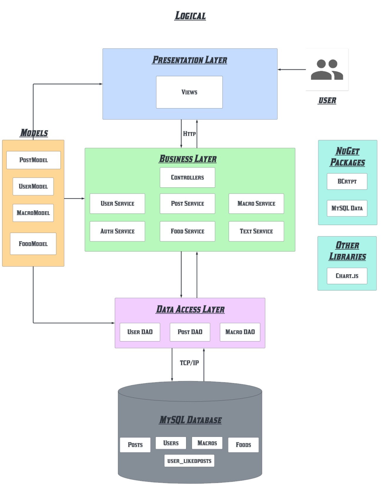
  

  
  - **Sitemap**
  

      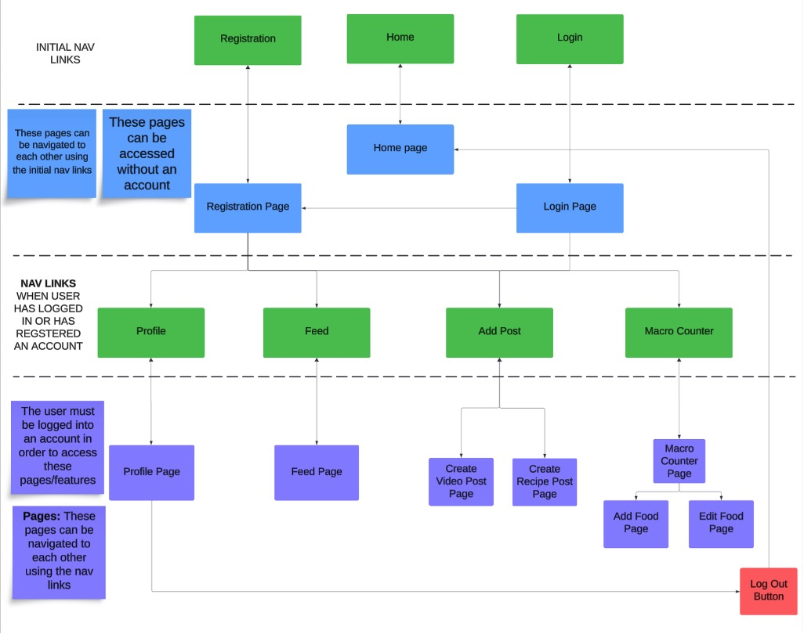
  

  - **User Interface Wireframes**
  

      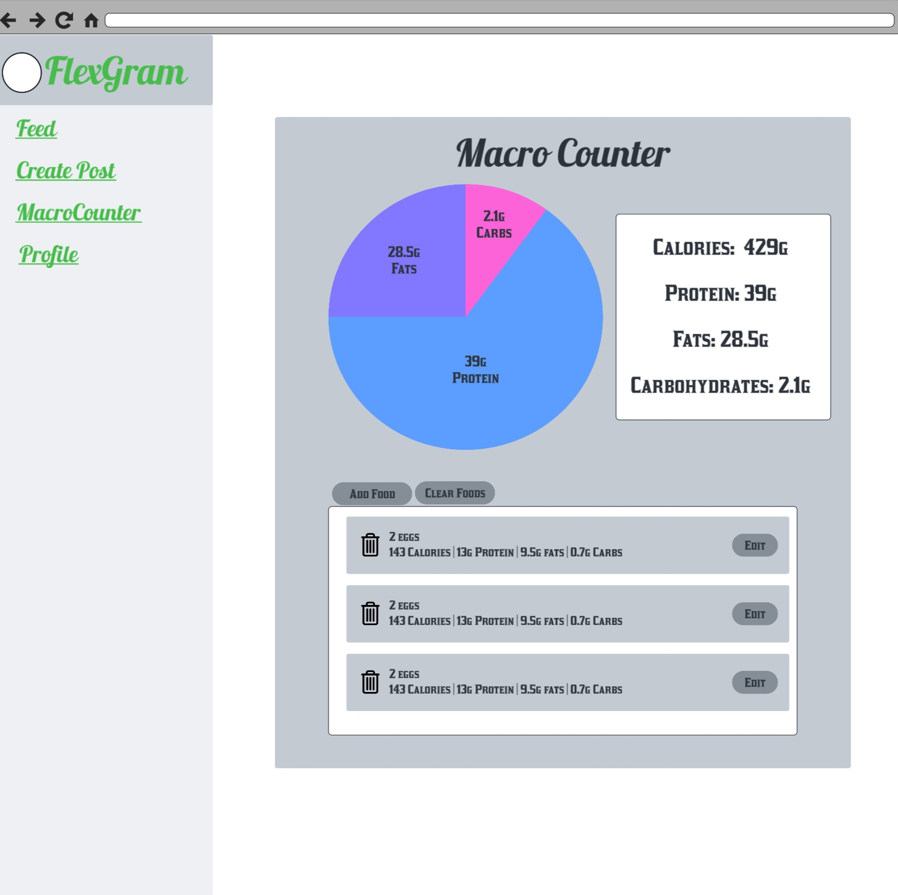
      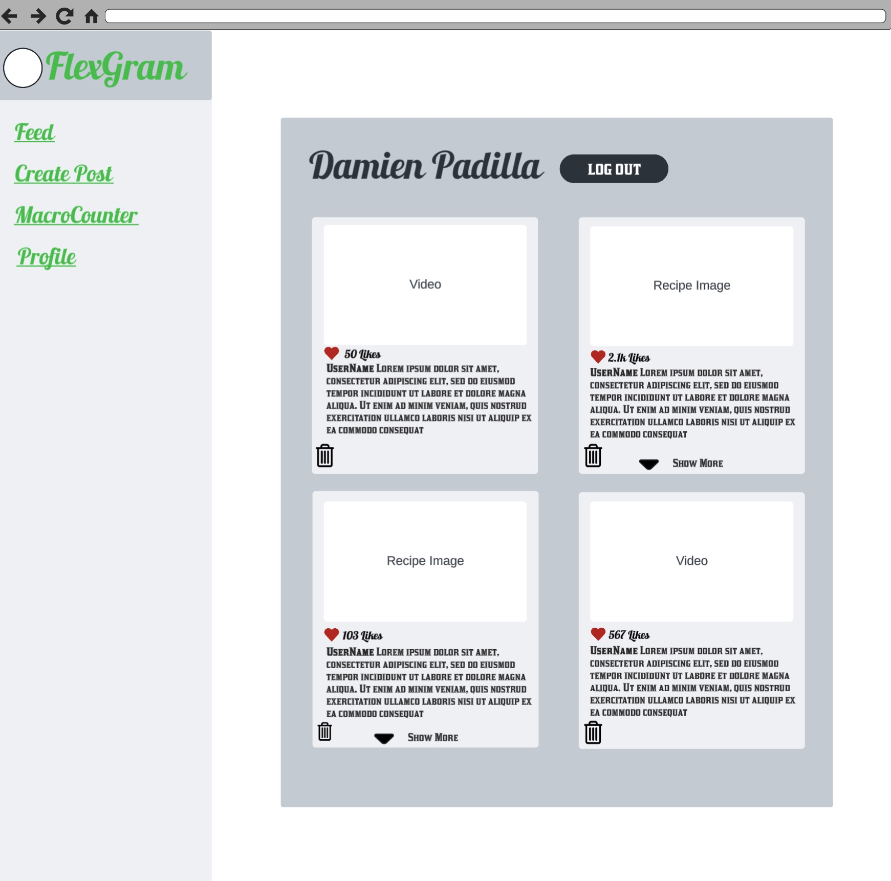
  

  
  - **Entity-Relationship Diagram**
  

    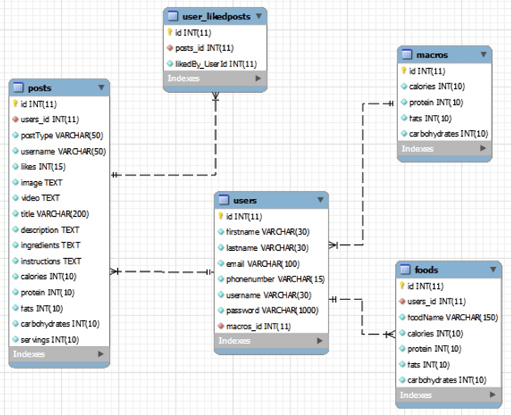
  

  

---

<h3>🧪 DevOps & Deployment</h3>

Not Hosted in the cloud yet.

---

<h3>🛑 Risks & Mitigation</h3>

- During our project proposal the team identified any potential risks that team may encounter and are meant to be addressed and managed throughout the project's implementation. 
- Below is a table with the risks that was found during the project's proposal phase:

| Risk                             | Resolution                                       |
| -------------------------------- | ------------------------------------------------ |
| Difficulty with responsive UI    | Practiced Bootstrap, explored responsive design. |
| Trouble with AJAX                | Research and practice using AJAX                 |
| Front end development may be lacking | Research and practice more with CSS and JavaScript|
| Pie chart visualization          | Learn how to implement Chart.js                  |
| ASP.NET Core Identity errors     | Alternative custom authentication approach (ex. Cookie-based Authentication)|      

---

<h3>❗ Outstanding Issues</h3>

- Further polish needed for UI consistency across different devices.
- Creating a Video post takes a while to upload
- When viewing a video post it tends to buffer sometimes.

---

<h3>🎓 Final Product</h3>
  

      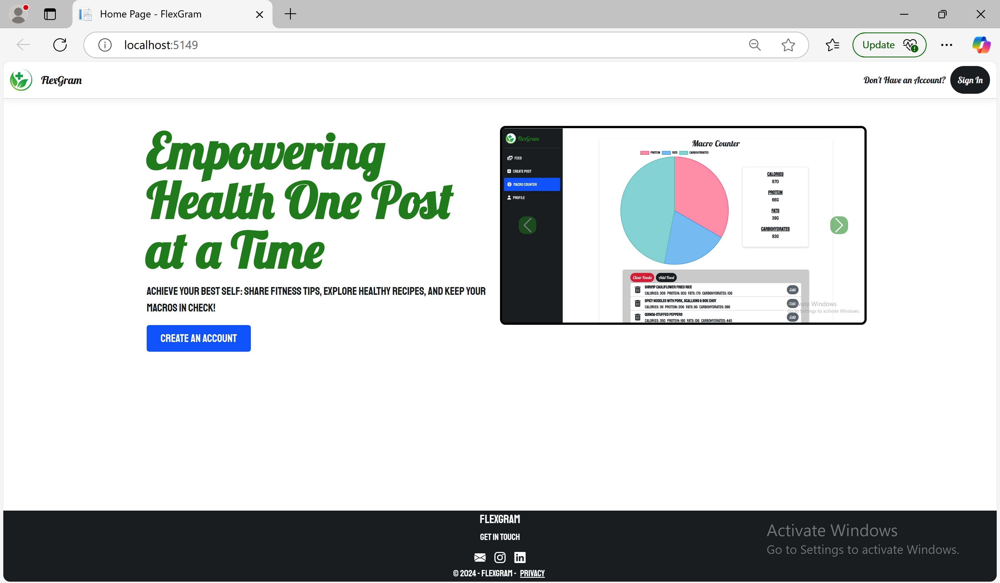
      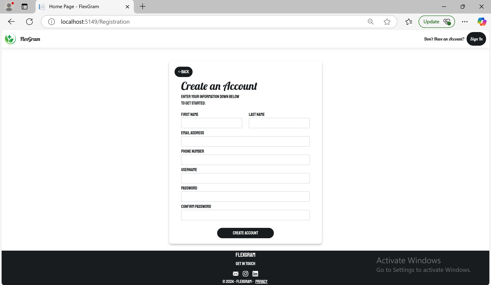
      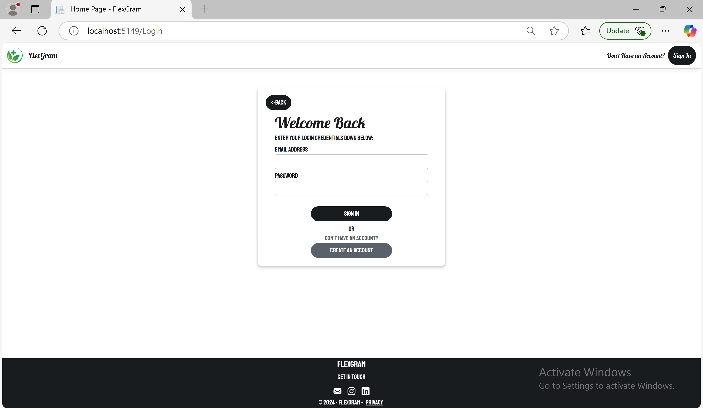
      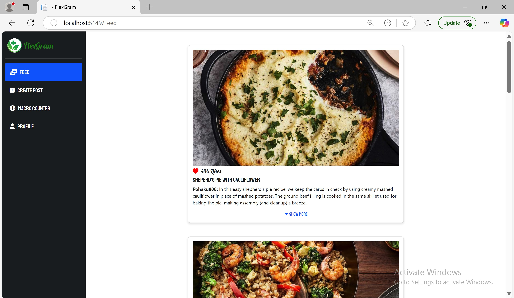
      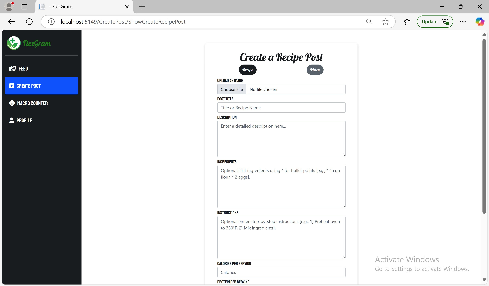
      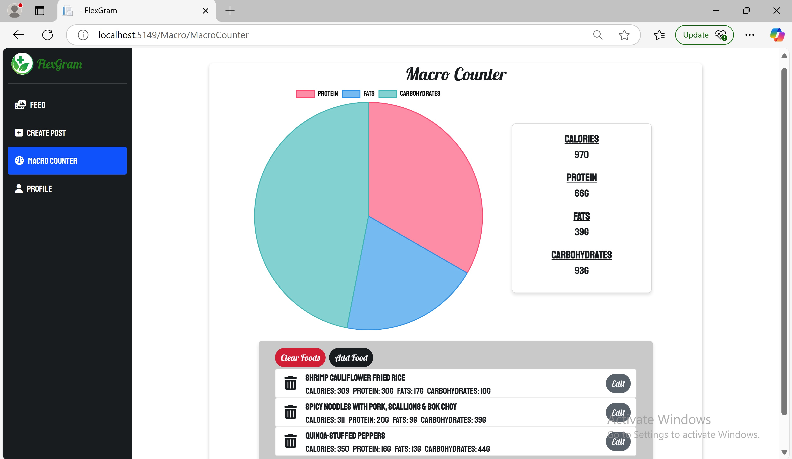
      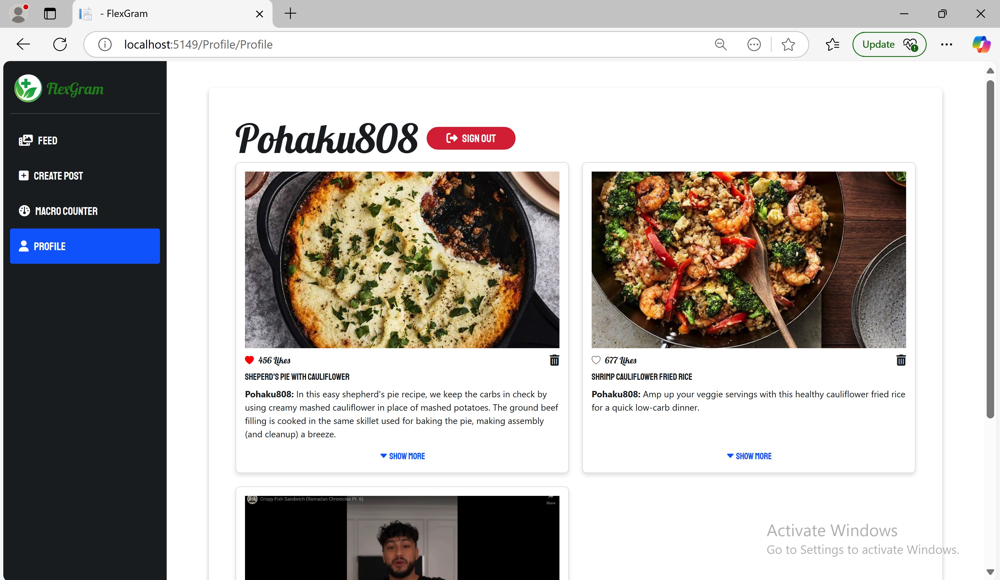
  

