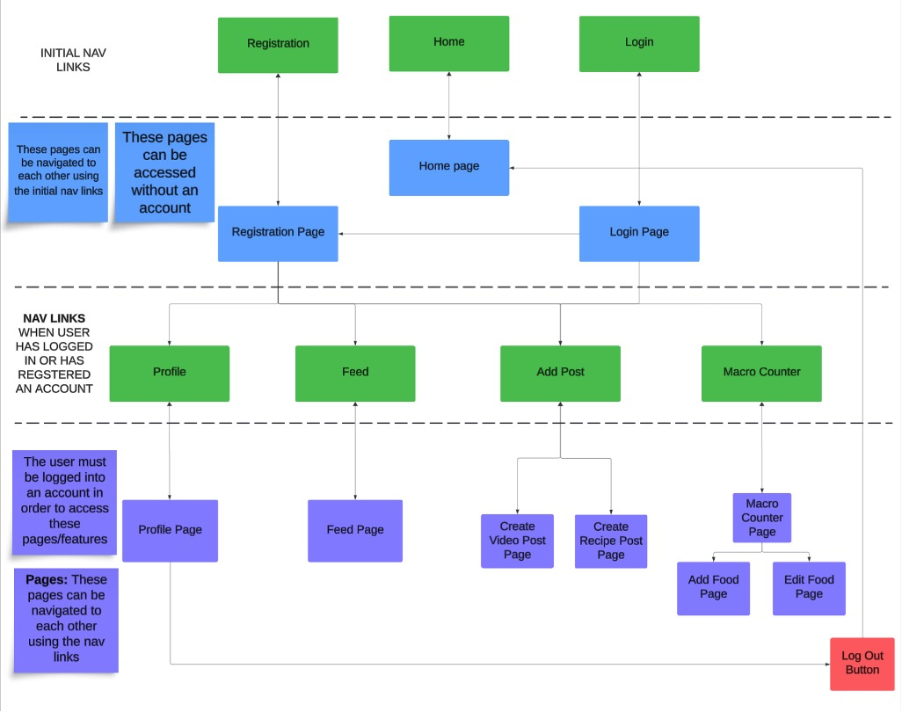

<h1 align="center">💪 FlexGram — A Health & Fitness Social Media Web App</h3>

<h3 align="center"><em>"Empowering health and fitness one post at a time"</em></h3>

---

<h3>📌 Introduction</h3>

FlexGram is a health and fitness-focused social media web application designed to foster a community around healthy living. Users can share recipes, workout content, health tips, and track macronutrients with a built-in macro counter. Our goal: one platform to empower users on their journey to better health.

---

<h3>🎯 Problem Statement</h3>

People often use scattered apps for recipes, workouts, and macro tracking. FlexGram centralizes these into one streamlined, community-driven platform to help users live healthier lives with motivation and social interaction.

---

<h3>✅ Functional Requirements</h3>

- Post and share healthy recipes, workout videos, and health tips.
- View and like other users’ content in a feed page.
- Track macronutrients and calories with a visual macro counter.
- Secure user authentication and profile management.

---

<h3>🔒 Non-Functional Requirements</h3>

- Passwords are hashed using BCrypt — no cleartext storage.

---

<h3>🛠 Technologies Used</h3>

| Tech               | Purpose                                                           |
| ------------------ | ----------------------------------------------------------------- |
| ASP.NET Core 8     | Backend Framework                                                 |
| MAMP               | Local database environment                                        |
| Bootstrap 5        | Responsive UI framework                                           |
| Chart.js           | Visual macro chart                                                |
| AJAX/JavaScript    | Asynchronous UI interactions & client-side interactivity          |
| HTML/CSS           | UI layout and styling                                             |
| BCrypt.NET         | Password hashing and security                                     |

---

<h3>🧠 New Technologies Learned</h3>

- BCrypt.NET for secure password storage.
- Chart.js for dynamic data visualizations.
- AJAX with Partial Views in ASP.NET for seamless updates.

---

<h3>🧰 Architecture & Design </h3>

- MVC pattern with N-layer architecture.
- Database ERD and DDL available: [GitHub Repo – DDL Scripts](#).
- Site structure includes Feed, Post Creation, Macro Counter, and Profile pages.
- Diagrams include:
  - Sitemap
  - 
  - UI wireframes
  - ERD
  - UML class diagrams (PDF)

---

<h3>🧪 DevOps & Deployment</h3>

While not yet cloud-hosted, FlexGram follows DevOps principles like:
- Modular, testable design.
- Environment-based configuration.
- Logging and diagnostics integration.

---

<h3>🛑 Risks & Mitigation</h3>

| Risk                             | Resolution                                  |
| -------------------------------- | ------------------------------------------- |
| Difficulty with responsive UI   | Practiced Bootstrap, explored responsive design. |
| Trouble with AJAX                | Researched and implemented partial views.  |
| Pie chart visualization          | Learned Chart.js integration.              |
| Identity errors                  | Alternative custom authentication approach. |

---

<h3>❗ Outstanding Issues</h3>

- Currently not deployed to a cloud environment.
- Further polish needed for UI consistency across mobile devices.

---

<h3>🎓 Final Thoughts</h3>

FlexGram was an incredible journey in full-stack development, real-world problem-solving, and creating an app with real community impact. With more refinement and cloud deployment, this project has the potential to become a go-to fitness and nutrition platform.

